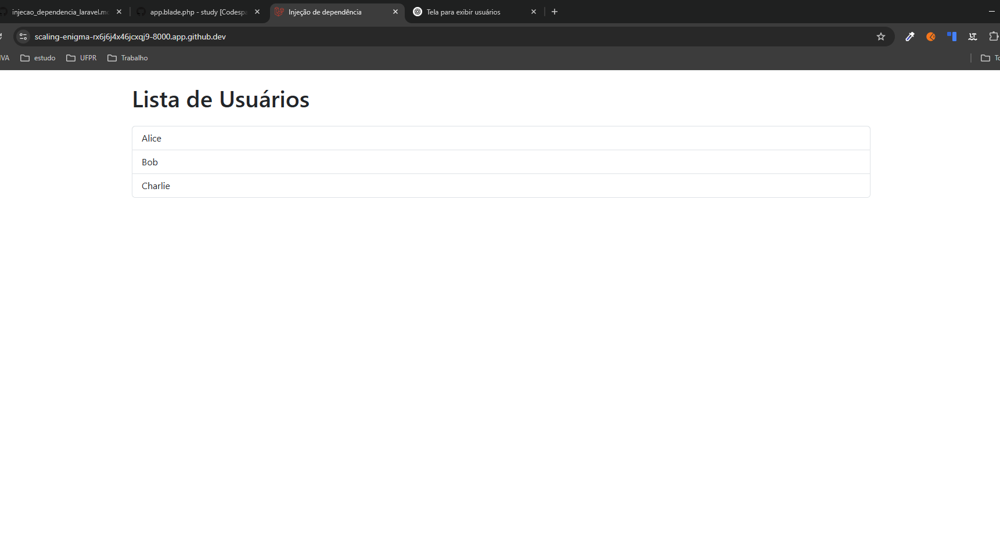

## Apêndice

A injeção de dependência (DI, do inglês Dependency Injection) é a capacidade de injetar dependencias em um objeto. Desta forma, as classes dependenm de abstração, em vez de dependerem de outras classes concretas.

O objetivo é facilitar a manutenção, tornar o código mais legivel e a distribuição de responsabilidade, tornando o código modular.

A injeção de dependência vem do princípio SOLID, com o objetivo de aumentar a reutilização de código, manutenibilidade e legibilidade.

Existem várias maneiras de criar uma injeção de dependência, são eles:
* setters
* injeção de construtor
* injeção de métodos
Entre outros.


### Principais funções na injeção de dependência
Para fazer uso de injeção de dependecia, é preciso ter 4 funções:

* O serviço que será consumido
* Cliente, quem usará o serviço (onde será injetado o serviço). 
* Interface que será usada pelo cliente e implementada pelo serviço, é opcional, mas é importante, é usado para padronizar, e forçar o uso de funções obrigatórias por exemplo.
* Injector, cria uma instância do serviço e injeta no cliente. 


### Agora, como funciona a Injeção de Dependência no Laravel?

O coração da injeção de dependência no Laravel é o *Service Container*. Ele é responsável por resolver automaticamente as dependências de classes e injetá-las onde forem necessárias. Isso significa que você não precisa instanciar manualmente as dependências de uma classe; o Laravel faz isso para você.

#### Exemplo

Suponha que você tenha uma classe UserService que depende de uma classe UserRepository. Em vez de instanciar UserRepository dentro de UserService, você pode injetá-la via construtor:

UserRepository
```
<?php

namespace App\Http\Repositories;


class UserRepository{
    public function getUsers()
    {
        return ['Alice', 'Bob', 'Charlie'];
    }
}

```

Services
```
<?php

namespace App\Http\Services;

use App\Http\Repositories\UserRepository;

class UserService{
    protected $userRepository;

    // Injeção de dependência via construtor
    public function __construct(UserRepository $userRepository)
    {
        $this->userRepository = $userRepository;
    }

    public function getAllUsers()
    {
        return $this->userRepository->getUsers();
    }
}
```

No exemplo acima, o Laravel automaticamente resolve a dependência UserRepository e a injeta no construtor de UserService quando você solicita uma instância de UserService.

#### Como o Laravel resolve as dependências?

O Laravel usa reflexão para inspecionar o construtor da classe e identificar quais dependências são necessárias. Ele então resolve essas dependências automaticamente a partir do *Service Container*. Se uma dependência não estiver registrada no container, o Laravel tenta instanciá-la automaticamente.

#### Registrando Dependências no Service Container

Em alguns casos, você pode querer registrar manualmente uma dependência no container. Isso é útil quando você precisa especificar como uma dependência deve ser resolvida. Por exemplo:

```
<?php

namespace App\Providers;

use Illuminate\Support\ServiceProvider;

class AppServiceProvider extends ServiceProvider
{
    /**
     * Register any application services.
     */
    public function register(): void
    {
        $this->app->bind(App\Http\Repositories\UserRepository::class, App\Http\Services\UserService::class);

    }

    /**
     * Bootstrap any application services.
     */
    public function boot(): void
    {
        //
    }
}

```

Agora, sempre que você solicitar UserService, o Laravel usará a função de callback para resolver a dependência.

#### Injeção de Dependência em Métodos

Além da injeção via construtor, o Laravel também permite injetar dependências diretamente em métodos de controllers, jobs, middlewares, etc. Por exemplo:

```
<?php

namespace App\Http\Controllers;

use App\Http\Services\UserService;

class UserController extends Controller
{
    public function index(UserService $userService)
    {
        $users = $userService->getAllUsers();
        return view('users.index', compact('users'));
    }
}

```

Aqui, o Laravel automaticamente injeta uma instância de UserService no método index.

### Benefícios da Injeção de Dependência no Laravel

1. *Desacoplamento*: As classes não precisam saber como criar suas dependências, o que promove um código mais modular.
2. *Testabilidade*: É fácil substituir dependências reais por mocks ou stubs em testes unitários.
3. *Manutenção*: Alterações nas dependências são mais fáceis de implementar, já que você só precisa modificar o container de serviços.
4. *Reutilização*: Dependências podem ser compartilhadas entre várias classes.

### Resumo

A injeção de dependência no Laravel 11 é uma técnica poderosa que permite gerenciar as dependências de suas classes de forma eficiente e organizada. O *Service Container* do Laravel facilita a resolução automática de dependências, tornando o desenvolvimento mais ágil e o código mais limpo. Ao utilizar DI, você segue boas práticas de programação, como o princípio da inversão de controle (IoC) e o desacoplamento de componentes.


